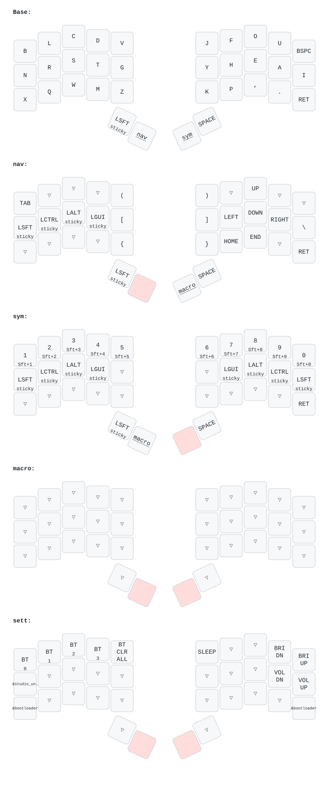

# Forager ZMK 

---

This is the ZMK config for [the Forager keyboard](https://github.com/carrefinho/forager).

[ZMK Studio](https://zmk.dev/docs/features/studio) is supported and enabled by default.

For more information on ZMK Modules and building locally, see [the ZMK docs page on modules.](https://zmk.dev/docs/features/modules)

To customize the behavior of the RGB LED, see [rgbled-widget documentation.](https://github.com/caksoylar/zmk-rgbled-widget)
